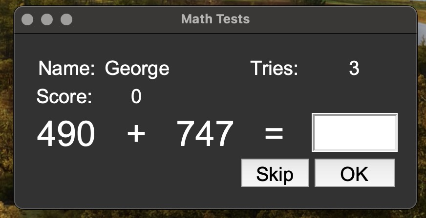

<h1>Math Tests Game Application</h1>

<h2>Description</h2>

The Math Tests Game is an interactive application that challenges users with random mathematical problems. Upon launching, users are prompted to enter their name. They are then presented with a series of math problems and their score, as well as the number of remaining tries, is tracked throughout the game.

<h2>Features</h2>

- Interactive UI: Built with tkinter, the application offers a user-friendly interface that's easy to navigate.
- Math Challenges: Generates random math challenges encompassing addition, subtraction, multiplication, and division.
- Scoring System: The game keeps track of the user's score, updating it with each correct answer.
- Tries System: Users have a limited number of tries. Once they're exhausted, the game ends.

Installation and Setup

1. Clone the repository:
    `git clone https://github.com/georgiosKachrimanis/math_problems`

2. Navigate to the repository:
    `cd path-to-repository`

3. Ensure you have Python and tkinter installed.

4. Run the main script:
    `python mathy.py` or `python3 mathy.py`
   
Screenshots
 

 

<h2>Usage</h2>

1. Upon launch, enter your name in the popup window.
2. Start solving math problems! 
3. For each problem, input your answer and click "OK" or skip with the "Skip" button.
4. Keep track of your score and tries on the main interface.

<h2>Contributions</h2>
Pull requests are welcome! For major changes, please open an issue first to discuss what you'd like to change.

Author
Georgios Kachrimanis

